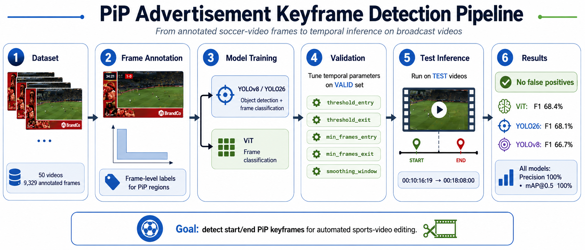
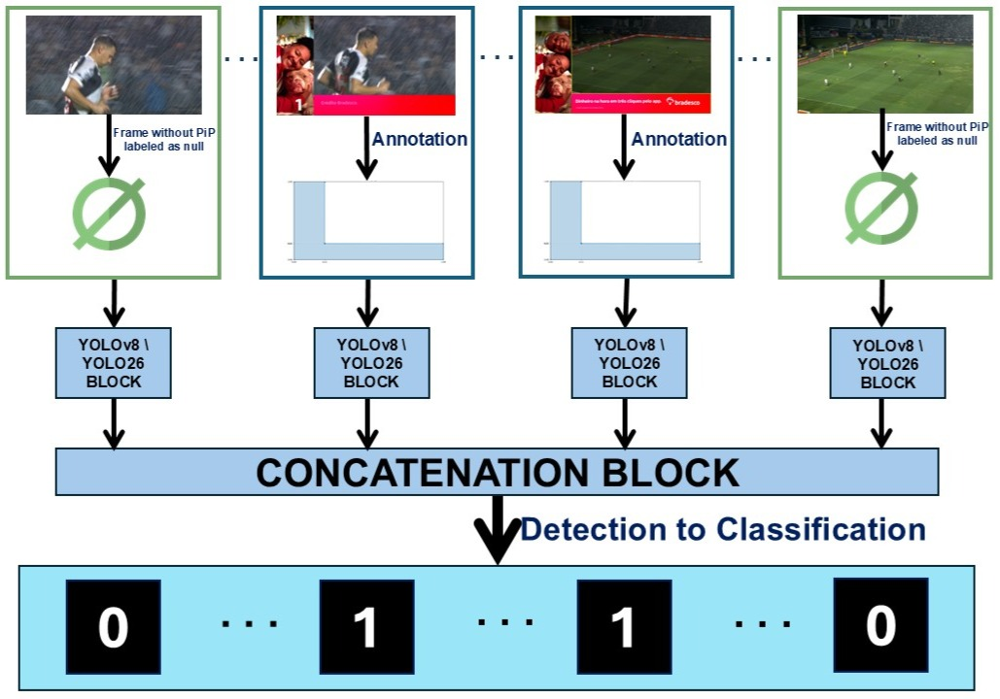
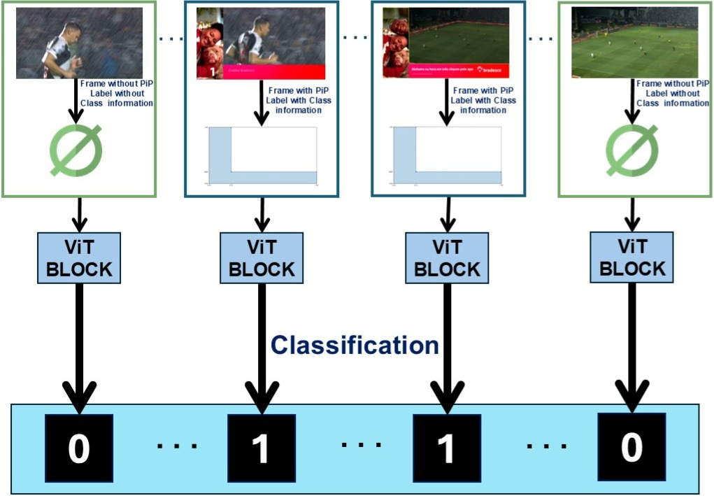

# YV8SKFRAME

<p align="center">
  <b>Detection of Picture-in-Picture advertising keyframes in soccer match videos</b><br>
  A reproducible training, validation and inference pipeline using <b>YOLOv8</b>, <b>YOLO26</b> and <b>Vision Transformer (ViT)</b>.
</p>

<p align="center">
  
  
  
  
  
  
</p>

<p align="center">
  
</p>

<p align="center">
  <b>Figure 1.</b> End-to-end pipeline for detecting the start and end keyframes of Picture-in-Picture advertisements in soccer match videos.
</p>

---

## Overview

`YV8SKFRAME` is a research repository for detecting the **start** and **end** keyframes of graphical **Picture-in-Picture (PiP) advertisements** in soccer match broadcasts.

The practical motivation is simple: in sports-video editing, finding the exact interval where an advertising overlay appears is a repetitive and time-consuming task. This project explores how computer vision models can help automate that step by returning the PiP interval directly as **drop-frame timecodes**, which are commonly used in professional non-linear editing workflows.

The repository compares three approaches:

- **YOLOv8** — object-detection baseline for locating the PiP advertising region;
- **YOLO26** — YOLO-family detector evaluated under the same temporal post-processing workflow;
- **Vision Transformer (ViT)** — frame-level classifier used as a complementary approach.

The final goal is not only to detect whether a frame contains PiP, but also to estimate **when the PiP starts and ends** in the original video.

---

## Main contributions

This repository accompanies a research project on automatic PiP keyframe detection in soccer videos. Its main contributions are:

1. **A dedicated PiP sports dataset**  
   The project uses 50 two-minute soccer match videos, including videos with and without PiP advertisements, with frame-level annotations.

2. **A comparison between visual paradigms**  
   The experiments compare **YOLOv8**, **YOLO26** and **ViT**, covering both object-detection and frame-classification strategies.

3. **A video-oriented inference pipeline**  
   The scripts operate directly on video files and return the detected start and end timecodes in **drop-frame format**, making the output suitable for editing and post-production workflows.

4. **A gradual temporal evaluation metric**  
   The work uses a **Fibonacci-based gradual accuracy metric**, which penalizes temporal deviations progressively and is more tolerant of very small frame-level differences than a purely exponential penalty.

---

## Modeling pipeline

Although the models are evaluated on the same task, they do not solve it in exactly the same way.

- **YOLOv8** and **YOLO26** are trained as object detectors. They learn the annotated PiP region, which follows the typical **L-shaped advertisement layout** used in the videos. Their detections are then converted into frame-level PiP/non-PiP decisions.
- **ViT** is trained as a frame classifier. Instead of localizing the object, it learns whether the whole frame contains a PiP advertisement or not.

This distinction is important because the PiP graphic appears gradually. At the beginning of the insertion, the L-shaped overlay may still be incomplete. This can affect object detectors differently from frame classifiers.

### YOLOv8 and YOLO26 pipeline

<p align="center">
  
</p>

<p align="center">
  <b>Figure 2.</b> Training the YOLOv8 and YOLO26 models, from frames extracted from the videos and the subsequent object detection and frame-level classification on the videos.
</p>

### ViT pipeline

<p align="center">
  
</p>

<p align="center">
  <b>Figure 3.</b> Training the ViT model, from frames extracted from the videos and the subsequent frame-level classification on the videos.
</p>

---

## Important path disclaimer

The examples in this repository assume that the project folder is downloaded or cloned directly to the root of the `C:` drive:

```text
C:\YV8SKFRAME
```

With this organization, the main paths become:

```text
C:\YV8SKFRAME\Fr_DataSet_S_K_Frame
C:\YV8SKFRAME\Vi_DataSet_S_K_Frame
C:\YV8SKFRAME\Codes
```

If you clone or download the repository to another location, update the paths in the notebooks and scripts before running the experiments.

---

## External video subsets

The validation and test video subsets are stored externally on Google Drive because the video files are too large to keep directly in this GitHub repository.

After downloading them, place the folders in the suggested local paths below.

| Subset | Google Drive folder | Suggested local path | Description |
|---|---|---|---|
| `VALID` | [Download VALID videos](https://drive.google.com/drive/folders/1SAf2bOr3g8WqvnCdbMRNaHNIgrl_ZHjV?usp=drive_link) | `C:\YV8SKFRAME\Vi_DataSet_S_K_Frame\VALID` | Video files used for validation and empirical tuning of temporal parameters. |
| `TEST` | [Download TEST videos](https://drive.google.com/drive/folders/1TM8sxrKdBjjbc76si9SqsdXeLJVVDQ3v?usp=drive_link) | `C:\YV8SKFRAME\Vi_DataSet_S_K_Frame\TEST` | Video files used for final inference and test-set reporting. |

---

## Repository structure

The current GitHub organization is expected to look like this:

```text
YV8SKFRAME/
│
├── Codes/
│   ├── train/                 # Training scripts
│   ├── valid/                 # Validation and parameter-tuning scripts
│   └── detect/                # Final inference scripts
│
├── DataSet_SoccerKeyFrame - Org/
│   └── DataSet_SoccerKeyFrame.xlsx  # Ground-truth start/end timecodes
│
├── Fr_DataSet_S_K_Frame/
│   ├── train/                 # Training frames and YOLO labels
│   ├── valid/                 # Validation frames and YOLO labels
│   ├── test/                  # Test frames and YOLO labels
│   ├── data.yaml              # YOLO dataset configuration
│   ├── training_results/      # Trained model outputs generated after training
│   ├── YOLOv8_Detect_results/ # YOLOv8 inference spreadsheets generated after detection
│   ├── YOLO26_Detect_results/ # YOLO26 inference spreadsheets generated after detection
│   └── ViT_Detect_results/    # ViT inference spreadsheets generated after detection
│
├── yv8skframe_github_package/
│   ├── assets/
│   │   ├── pipeline_keyframe_detection.png # README header pipeline figure
│   │   ├── pipeline_yolo_yolo26.jpg        # YOLOv8/YOLO26 pipeline figure
│   │   ├── pipeline_vit.jpg                # ViT pipeline figure
│   │   └── pipeline.svg                    # General project pipeline figure
│   └── YV8SKFRAME_walkthrough.ipynb        # Guided notebook explaining the workflow
│
├── .gitattributes
├── .gitignore
├── LICENSE
└── README.md
```

> **Note about generated-result folders:** inside `Fr_DataSet_S_K_Frame/`, the folders `training_results/`, `YOLOv8_Detect_results/`, `YOLO26_Detect_results/` and `ViT_Detect_results/` are intentionally kept in the repository as empty directories. Their contents are not included because trained weights, logs, plots and inference spreadsheets can become large. As the experiments are executed, the corresponding outputs will be saved automatically into these folders by the training and inference scripts.

---

## Research workflow

The project follows a three-step workflow: **training**, **validation/tuning** and **test inference**.

### 1. Train the models

Use the frame dataset and the training scripts:

```text
C:\YV8SKFRAME\Fr_DataSet_S_K_Frame\train
C:\YV8SKFRAME\Codes\train
```

Typical YOLO training command:

```python
from ultralytics import YOLO

model = YOLO("yolov8n.pt")  # or YOLO("yolo26n.pt")

results = model.train(
    data="C:/YV8SKFRAME/Fr_DataSet_S_K_Frame/data.yaml",
    epochs=50,
    imgsz=(640, 360),
    batch=16,
    project="C:/YV8SKFRAME/Fr_DataSet_S_K_Frame/training_results",
    name="yolov8n_Soccer-Key-Frames"
)
```

For YOLO26, change the model and experiment name:

```python
model = YOLO("yolo26n.pt")
name = "yolo26n_Soccer-Key-Frames"
```

Typical ViT training setup:

```python
from transformers import ViTForImageClassification, AutoImageProcessor, TrainingArguments, Trainer

MODEL_ID = "google/vit-base-patch16-224-in21k"
OUTPUT_DIR = "C:/YV8SKFRAME/Fr_DataSet_S_K_Frame/ViT_training_results/vit_Soccer-Key-Frames"

processor = AutoImageProcessor.from_pretrained(MODEL_ID)
model = ViTForImageClassification.from_pretrained(
    MODEL_ID,
    num_labels=2,
    id2label={0: "without_pip", 1: "with_pip"},
    label2id={"without_pip": 0, "with_pip": 1}
)

training_args = TrainingArguments(
    output_dir=OUTPUT_DIR,
    num_train_epochs=50,
    per_device_train_batch_size=16,
    per_device_eval_batch_size=16,
    learning_rate=2e-4,
    evaluation_strategy="steps",
    save_strategy="steps",
    logging_steps=100,
    load_best_model_at_end=True,
    remove_unused_columns=False
)

# The repository training scripts build the PyTorch datasets, collate function,
# metric computation and Trainer object using the frame folders and labels.
# See: C:/YV8SKFRAME/Codes/train
```

### 2. Validate and tune temporal parameters

Use the validation videos and validation scripts:

```text
C:\YV8SKFRAME\Vi_DataSet_S_K_Frame\VALID
C:\YV8SKFRAME\Codes\valid
```

The validation step is used to tune temporal post-processing parameters. The method uses two different thresholds: one to enter a PiP segment and another to exit it.

| Parameter | YOLOv8 | YOLO26 | ViT |
|---|---:|---:|---:|
| `threshold_entry` | 0.90 | 0.30 | 0.40 |
| `threshold_exit` | 0.98 | 0.98 | 0.94 |
| `min_frames_entry` | 15 | 2 | 15 |
| `min_frames_exit` | 3 | 3 | 3 |
| `smoothing_window` | 5 | 5 | 5 |
| `min_duration_sec` | 2 | 2 | 2 |
| `min_gap_sec` | 2 | 2 | 2 |

### 3. Run final inference on the test subset

After the temporal parameters are tuned empirically, use the test videos and detection scripts:

```text
C:\YV8SKFRAME\Vi_DataSet_S_K_Frame\TEST
C:\YV8SKFRAME\Codes\detect
```

The final inference scripts process each video, detect PiP segments and export spreadsheets comparing detected and ground-truth start/end timecodes.

Typical outputs are saved in:

```text
C:\YV8SKFRAME\Fr_DataSet_S_K_Frame\YOLOv8_Detect_results
C:\YV8SKFRAME\Fr_DataSet_S_K_Frame\YOLO26_Detect_results
C:\YV8SKFRAME\Fr_DataSet_S_K_Frame\ViT_Detect_results
```

---

## Main findings

The experiments showed that **none of the evaluated models produced false positives** in the final test subset. This is important in an editing scenario because false positives could lead to incorrect cuts in journalistic content.

The main differences appeared in temporal recall and F1-score:

| Model | Precision (%) | Recall (%) | F1 (%) | mAP@0.5 (%) |
|---|---:|---:|---:|---:|
| YOLOv8 | 100.0 | 50.0 | 66.7 | 100.0 |
| YOLO26 | 100.0 | 51.7 | 68.1 | 100.0 |
| ViT | 100.0 | 52.0 | 68.4 | 100.0 |

In the analyzed test videos, **ViT** was more accurate at detecting the beginning of the PiP insertion, probably because it classifies the whole frame and does not depend on the complete visual formation of the L-shaped object. **YOLO26** was slightly more accurate at detecting the end of the PiP insertion, suggesting that the paradigms may be complementary.

---

## Jupyter Notebook walkthrough

A guided notebook is available in:

```text
yv8skframe_github_package/YV8SKFRAME_walkthrough.ipynb
```

It explains:

- how the folders are expected to be organized;
- how to check the dataset paths;
- how YOLOv8, YOLO26 and ViT are trained;
- how validation videos are used for parameter tuning;
- how inference is performed on the test videos;
- how the final Excel reports are generated.

The notebook is written as a practical walkthrough, so it can be used both to reproduce the experiments and to present the project.

---

## Main dependencies

```bash
pip install ultralytics opencv-python pandas numpy matplotlib openpyxl torch torchvision transformers pillow
```

Depending on your environment, GPU-enabled PyTorch may require a specific CUDA-compatible installation. Check the official PyTorch installation selector before training larger experiments locally.

---

## Minimal example: loading a trained YOLO model

```python
from ultralytics import YOLO

model_path = "C:/YV8SKFRAME/Fr_DataSet_S_K_Frame/training_results/yolo26n_Soccer-Key-Frames/weights/best.pt"
model = YOLO(model_path)

results = model("C:/YV8SKFRAME/Fr_DataSet_S_K_Frame/test/images/example.jpg", save=True)
```

---

## Limitations and future work

This dataset was built from videos from a single broadcaster. For that reason, broader claims about generalization should be made carefully.

Future work includes:

- expanding the dataset to videos from other broadcasters;
- performing cross-source validation;
- investigating the impact of higher frame-sampling rates on YOLO-based models;
- exploring semi-supervised learning to reduce the cost of frame-level annotation.

---

## Citation

If this repository helps your work, please cite the associated paper:

```bibtex
@inproceedings{mendes2026pipkeyframes,
  title     = {Detecção de Keyframes de Publicidade Picture-in-Picture em Vídeos de Partidas de Futebol},
  author    = {Mendes Junior, Mauro Nunes and Andrade, Fábio Augusto de Alcantara and Passos, Wesley Lobato and Gois, Jonathan Nogueira and Lima, Amaro Azevedo de and Araujo, Gabriel Matos},
  booktitle = {XLIV Simpósio Brasileiro de Telecomunicações e Processamento de Sinais},
  year      = {2026},
  address   = {Salvador, BA, Brazil}
}
```

---

## Project status

This repository is part of an academic research project on automatic keyframe detection for sports broadcast editing. The current implementation focuses on soccer videos with PiP advertising overlays. Future extensions may include higher frame-rate sampling, additional detectors, temporal models and broader sports-broadcast datasets.
